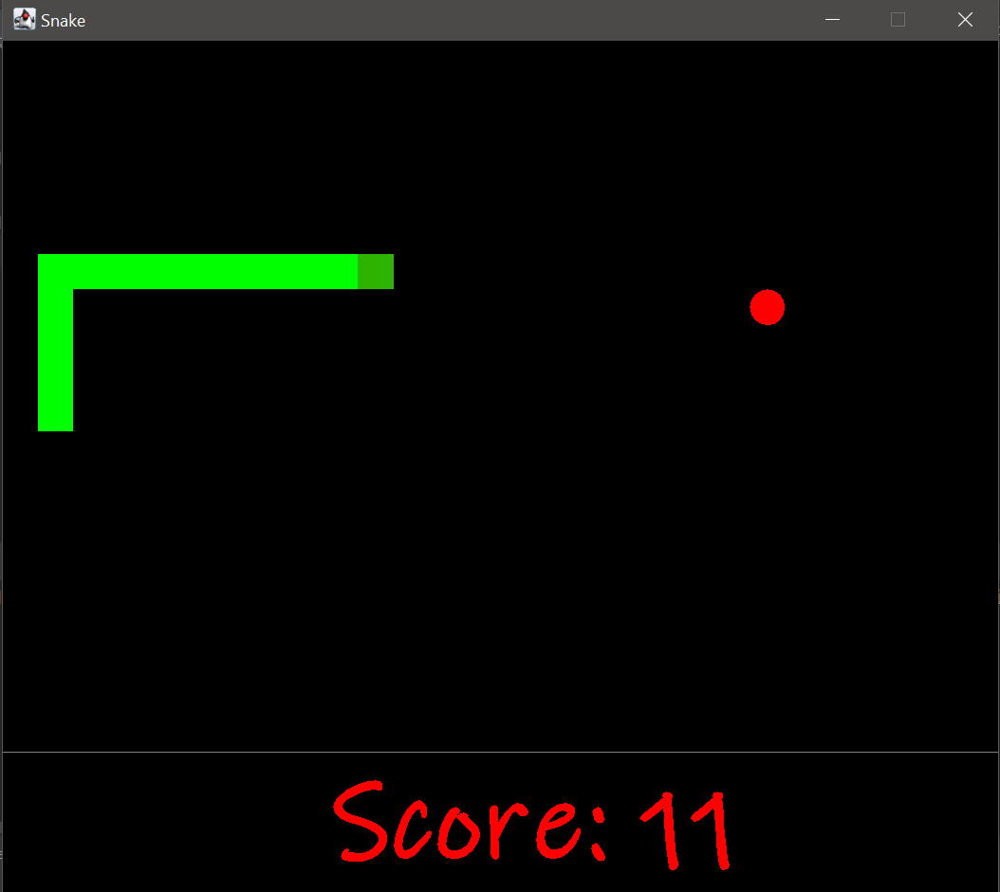
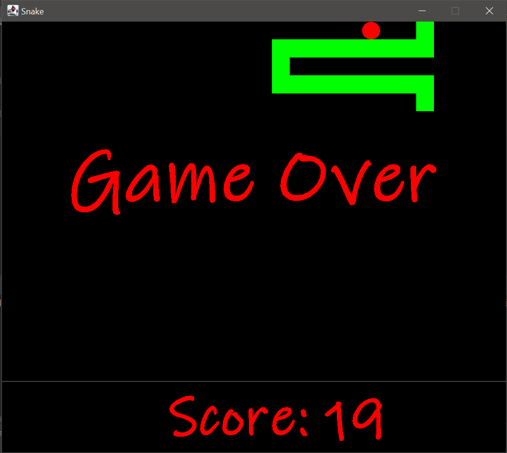
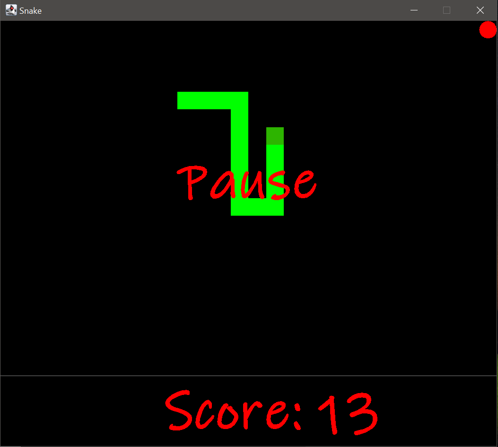

# Snake_game
A classic snake game implemented in Java Swing.
## Getting started
These instructions will get you a copy of the project up and running on your local machine 
for development and testing purposes. See deployment for notes on how to deploy the project on a live system.

### Prerequisites
What things you need to install the software and how to install them:
* Java SE Development Kit (JDK) 8 or higher
* An IDE such as Eclipse or IntelliJ IDEA

### Installing
1. Clone the repository to your local machine: https://github.com/WajdaHub/Snake_game.git
2. Open the project in your IDE and build the project.
3. Run the Main class to start the game.

##  How to play
* Use the arrow keys to control the snake.
* Eat the food to grow longer.
* Don't hit the walls or the snake's own body.

## Preview

